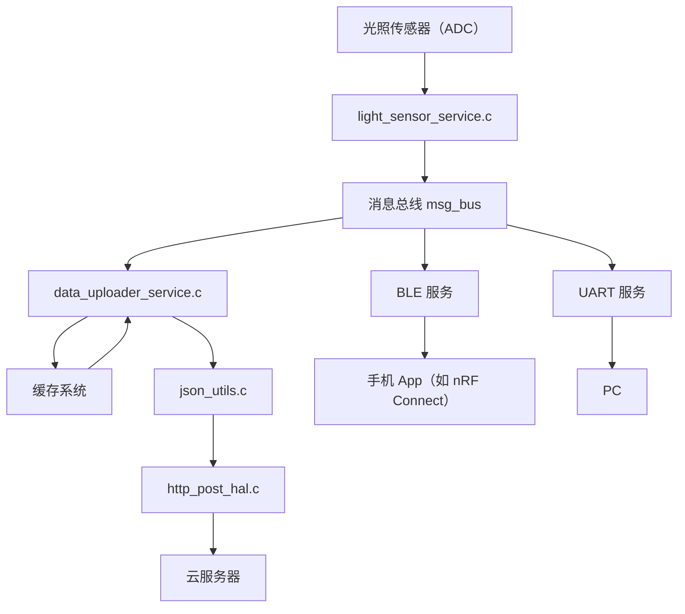

# ESP32 模块化物联网框架
[🇨🇳 中文版本 README.zh-CN.md](README.zh-CN.md) | [🇺🇸 English Version README.md](README.md)

一个基于 ESP32-S3 和 ESP-IDF 5.4 的完全模块化嵌入式系统项目。集成了 UART、Wi-Fi、HTTPS 云通信、基于 ADC 的光照传感器（可拓展为任意传感器）、**BLE GATT 通信服务**，并计划支持 MQTT。

[🇺🇸 English Version](README.md)

[](https://github.com/MrRaidrop/esp32_ble_mqtt_https_sensors/actions)

---

## 项目特性

* 自动重连 Wi-Fi 管理器
* 周期性通过 ADC 读取光照传感器（当前仅使用光照传感器）
* 安全的 HTTPS JSON 数据上报
* 数据上报模块每 5 秒上传一次
* UART 回显传感器调试数据
* BLE GATT 服务：通过 Notify 向手机发送传感器数据
* 模块化组件布局（使用 ESP-IDF components/ 目录）
* Wi-Fi OTA 固件升级（默认启动 30 秒后执行）
* 预留 MQTT 集成功能

---

## 项目结构

```
project-root
├── components/                 # 模块目录
│   ├── hal/                    # 硬件抽象层（ADC、UART、Wi-Fi）
│   ├── core/                   # 核心消息通信系统（如 msg_bus）
│   ├── net/                    # 网络功能模块（HTTPS POST、预留 MQTT）
│   ├── OTA/                    # OTA 支持（基于 HTTPS）
│   ├── service/                # 业务逻辑（FreeRTOS 任务、BLE、上传）
│   └── utils/                  # 通用工具（JSON 工具、日志、缓存等）
├── main/                       # 应用入口
├── .github/workflows/         # GitHub Actions CI
├── server/                    # OTA 测试服务器（可选）
└── README.md
```

---

## 架构图



> 模块化架构便于灵活组合服务、单元测试扩展，并为 MQTT 等功能预留接口。

---

## 快速上手

### 1. 环境要求

* 安装并配置 ESP-IDF 5.4（推荐使用 VSCode 插件）
* 支持的开发板：ESP32-S3 DevKit
* 可联网环境（用于云上传）
* 手机安装 BLE 工具，如 **nRF Connect**

### 2. 构建与烧录

```bash
idf.py set-target esp32s3
idf.py build
idf.py -p /dev/ttyUSB0 flash monitor
```

### 3. Wi-Fi 配置

在 `utils/config.h` 中设置你的 Wi-Fi 信息：

```c
#define WIFI_SSID "your-ssid"
#define WIFI_PASS "your-password"
```

最终会传入 `wifi_service.c` 进行连接。

### 4. BLE 验证

* 安装 nRF Connect（或其他 BLE 工具）
* 扫描并连接 `ESP_GATTS_DEMO`
* 定位到服务 UUID `0x00FF` 下的特征值
* 开启 Notify
* 接收 4 字节的小端整数，例如光照强度 `0x0802 = 520`

### 5. OTA 升级测试

固件启动后连接 Wi-Fi → 计时 30 秒 → 发起 HTTPS OTA 请求：

```text
https://<your_server_ip>:8443/firmware.bin
```

请参考 `/server/README_SERVER.md` 完整部署 OTA 服务。

---

## JSON 上传格式

默认上传格式如下（类型、数值、时间戳）：

```json
{
  "type": "light",
  "value": 472,
  "ts": 1713302934
}
```

如需字段式输出，可修改 `json_utils.c`：

```json
{
  "timestamp": "2025-04-11T14:23:52",
  "light": 472,
  "count": 23
}
```

---

## 路线图与功能状态

| 功能项                | 状态     | 说明                                |
| ------------------ | ------ | --------------------------------- |
| 光照传感器 ADC 驱动       | ✅ 已完成  | 每秒读取一次，通过消息总线发布                   |
| JSON 打包工具          | ✅ 已完成  | 使用结构化字段格式生成 JSON                  |
| HTTPS POST 上传      | ✅ 已完成  | 支持重试机制                            |
| BLE GATT Notify    | ✅ 已完成  | 从总线订阅并通知手机                        |
| UART 数据输出          | ✅ 已完成  | 通过 UART 输出光照数值                    |
| 上传重试 + 缓存机制        | ✅ 已完成  | RAM 环形缓存，支持 flush\_with\_sender() |
| 模块化任务结构            | ✅ 已完成  | 各模块独立运行在 FreeRTOS 任务中             |
| OTA 升级（Wi-Fi）      | ✅ 已完成  | 使用 `esp_https_ota()` 实现 OTA       |
| GitHub CI + 文档     | ✅ 已完成  | 提供架构图与自动化测试                       |
| MQTT 支持            | ⏳ 进行中  | 添加 MQTT TLS 上传功能                  |
| BLE OTA 升级         | 🔜 计划中 | 支持通过 BLE 实现 OTA                   |
| DMA + 环形缓冲支持       | 🔜 计划中 | 支持超声波等高速采样传感器                     |
| Flutter BLE UI App | 🔜 计划中 | BLE 可视化面板                         |
| Flutter BLE OTA    | 🔜 计划中 | 在手机端集成 BLE OTA                    |

---

## 当前已知问题与改进方向

| 类别        | 问题描述                | 改进方向                              | 状态     |
| --------- | ------------------- | --------------------------------- | ------ |
| 架构        | 无统一服务生命周期管理器        | 增加 `service_registry` 与统一初始化流程    | ⏳ 进行中  |
| 配置系统      | 配置项写死在 `.c` 文件中     | 使用 `Kconfig` + NVS 配置覆盖机制         | 🔜 计划中 |
| 日志模块      | 使用 LOGI/LOGW，控制粒度不够 | 增加 `LOG_MODULE_REGISTER` 模块日志级别控制 | ⏳ 进行中  |
| 单元测试      | CI 仅测试了 BLE 工具模块    | 添加 JSON、缓存、上传模块测试                 | ⏳ 进行中  |
| HTTPS 安全性 | 未验证 TLS 证书          | 增加证书验证与 CA 配置切换                   | 🔜 计划中 |
| OTA 安全性   | 未校验镜像或支持回滚          | 增加 SHA256 + 双分区回滚机制               | 🔜 计划中 |
| BLE 扩展性   | 仅支持 Notify，不支持写命令   | 增强 GATT Profile，增加控制指令            | ⏳ 进行中  |

---

## 应用场景示例

* 低功耗传感器节点，支持云日志上传
* BLE + UART + MQTT 的混合物联网边缘设备
* 支持 REST API 与移动设备访问的多传感器/执行器集线器

---

## 授权协议

本项目使用 MIT 协议，自由使用、修改与集成。

---

🛠️ 最后更新：2025 年 5 月 1 日
作者：[Greyson Yu](https://github.com/MrRaidrop)
