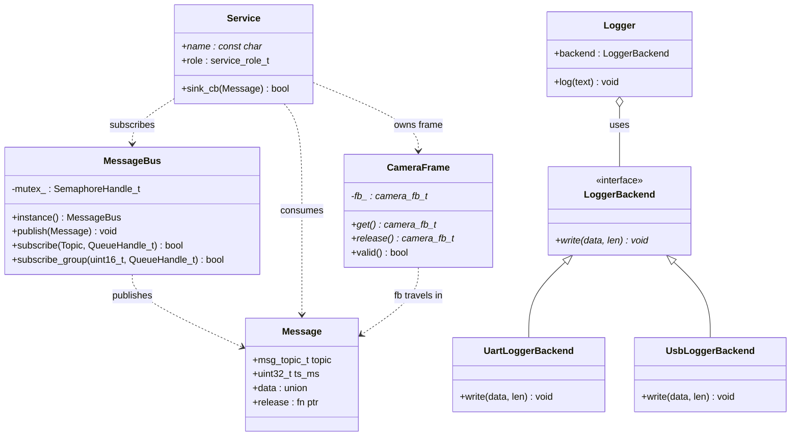

# Optional C++ Refactor / Demo Layer

ESP-MoNet is and stays a C/FreeRTOS project. This document describes an
**optional, experimental** C++ layer that demonstrates how the existing C
architecture maps to embedded-friendly C++ — without rewriting anything.

> **Default is off.** The whole layer is gated behind
> `CONFIG_MONET_CPP_EXPERIMENTAL` (default `n`). When disabled, no C++ source
> is compiled and the firmware builds, links, and runs exactly as the stable
> C path with zero flash/RAM cost.

## Goals & non-goals

- **Goal:** show the C → C++ mapping for the patterns already used in this
  codebase (ops-tables, init/deinit pairs, release hooks, `void*` queues, the
  message bus) using only embedded-safe C++.
- **Goal:** keep the stable C implementation as the default and untouched.
- **Non-goal:** rewrite services in C++ or replace `msg_bus.c` /
  `service_registry.c`. The C++ `MessageBus` is a *parallel illustration*, not
  a drop-in replacement.

## What "embedded-friendly C++" means here

Used: `class`, constructor/destructor, RAII, `enum class`/`constexpr`,
templates, simple pure-virtual interfaces, `= delete`, move semantics.

Avoided: exceptions, RTTI, `iostream`, heavy STL, and dynamic allocation.
ESP-IDF already defaults `CONFIG_COMPILER_CXX_EXCEPTIONS=n` and
`CONFIG_COMPILER_CXX_RTTI=n`; this layer stays within that. Storage is static
(function-local statics, fixed arrays, `xQueueCreateStatic`), so there is no
heap use in the demo path.

## How to enable

```sh
idf.py menuconfig
#   Component config → Monet Core → [*] Enable experimental C++ wrappers/refactor layer
#   (and optionally pick the C++ Logger backend: UART or USB-CDC)
idf.py build flash monitor
```

Or non-interactively, add to `sdkconfig` / an `sdkconfig.defaults`:

```
CONFIG_MONET_CPP_EXPERIMENTAL=y
```

When enabled, `app_main()` calls `monet_cpp_demo_run()` once at startup, which
exercises every abstraction below and logs the result under the `CPP_DEMO`
tag.

## File layout

```
components/monet_core/
  Kconfig                         # CONFIG_MONET_CPP_EXPERIMENTAL (+ logger choice)
  CMakeLists.txt                  # conditionally adds src_cpp/ + include_cpp/
  include/monet_core/             # existing C headers — unchanged
    msg_bus.h
    service_registry.h
  src/                            # existing C sources — unchanged (stable path)
    msg_bus.c
    service_registry.c
  include_cpp/monet_core_cpp/     # C++ headers (only on INCLUDE_DIRS when enabled)
    Queue.hpp
    LockGuard.hpp
    CameraFrame.hpp
    LoggerBackend.hpp
    MessageBus.hpp
    message_bus_capi.h            # C-safe wrappers around the C++ bus
    button_isr_demo.h             # C-callable: GPIO ISR -> queue -> task demo
    cpp_demo.h                    # C-callable demo entry point
  src_cpp/                        # C++ sources (only compiled when enabled)
    CameraFrame.cpp
    Logger.cpp
    MessageBus.cpp
    button_isr_demo.cpp
    cpp_demo.cpp
```

The conditional compilation lives in `components/monet_core/CMakeLists.txt`:

```cmake
set(srcs src/msg_bus.c src/service_registry.c)   # always
set(include_dirs include)
if(CONFIG_MONET_CPP_EXPERIMENTAL)
    list(APPEND srcs src_cpp/CameraFrame.cpp src_cpp/Logger.cpp
                     src_cpp/MessageBus.cpp src_cpp/button_isr_demo.cpp
                     src_cpp/cpp_demo.cpp)
    list(APPEND include_dirs include_cpp)
endif()
idf_component_register(SRCS ${srcs} INCLUDE_DIRS ${include_dirs}
                       REQUIRES utils monet_hal esp_driver_gpio)
```

## The C → C++ mapping

| C idiom in this codebase | C++ equivalent | Where to look |
| --- | --- | --- |
| `struct + ctx pointer` passed to every function | object + implicit `this` | `MessageBus` (fields replace file-statics) |
| function-pointer / ops-table (`sink_cb_t`, `service_desc_t`) | interface / virtual function (vtable *is* the ops-table, `this` *is* the ctx) | `LoggerBackend` |
| manual `init()` / `deinit()` pair | constructor / destructor | `Queue`, `MessageBus`, `CameraFrame` |
| manual release hook (`msg_t.release`, `esp_camera_fb_return`) | RAII destructor | `CameraFrame` |
| `xSemaphoreTake` … `xSemaphoreGive` around a critical section | RAII `LockGuard` | `LockGuard`, used inside `MessageBus` |
| FreeRTOS queue with `void*` + `sizeof(T)` written by hand | `Queue<T, N>` (size derived from `T`) | `Queue` |
| Zephyr-style workqueue / message bus | FreeRTOS worker task + queue + callback (the existing `service_registry` dispatch task + `msg_bus`) | mirrored by `MessageBus` |

### 1. `LockGuard` — RAII over a FreeRTOS mutex

The C bus takes a mutex and must remember to give it back on **every** return
path. `LockGuard` takes it in the constructor and gives it back in the
destructor, so an early `return` can never leak the lock.

```cpp
{
    monet::LockGuard lock(mutex);   // xSemaphoreTake
    if (full) return;               // still released
    ...
}                                   // xSemaphoreGive
```

### 2. `Queue<T, N>` — type-safe queue

`xQueueCreate(8, sizeof(msg_t))` puts the element size in the caller's hands; a
mismatch corrupts memory silently. `Queue<T, N>` derives the size from `T`, so
`send()`/`receive()` only accept the right type. Backed by
`xQueueCreateStatic` (no heap). `handle()` still exposes the raw
`QueueHandle_t` for existing C APIs such as `msg_bus_subscribe`.

### 3. `CameraFrame` — RAII for zero-copy frames

The camera pipeline passes `camera_fb_t*` without copying pixels and relies on
`esp_camera_fb_return()` being called exactly once. `CameraFrame` owns the
pointer, returns it in its destructor, is **non-copyable** (copying would
double-return), and is **movable** so the buffer can be handed off zero-copy.
`release()` detaches the pointer for handing back to a C release-hook flow.

> The demo uses a stack stand-in and `release()`s it before scope exit, so the
> driver's return is never called on a non-driver buffer. In production you
> write `CameraFrame frame(esp_camera_fb_get());` and let RAII do the return.

### 4. `LoggerBackend` — interface / polymorphism

A C ops-table of function pointers becomes a pure-virtual interface. Runtime
polymorphism earns its keep only when you actually need runtime backend
selection or fallback (e.g. switch UART → USB when a host attaches). Where the
backend is fixed, `logger_default_backend()` still lets **Kconfig** pick the
concrete type at build time so unused transports do not cost flash. Backends
are static singletons (no heap).

### 5. `MessageBus` — the bus as a class

`MessageBus` mirrors `msg_bus.c` (same fan-out, same non-blocking sends, same
group rule) but the subscriber tables are object members instead of
file-statics, and every method guards the mutex with `LockGuard`. C modules
can drive it through the C API in `message_bus_capi.h`
(`monet_cpp_bus_publish` / `monet_cpp_bus_subscribe[_group]`) — names kept
distinct from `msg_bus_*` so the stable C API is never shadowed.

### 6. `button_isr_demo` — ISR → queue → task

The canonical embedded interrupt pattern: a falling-edge ISR on the BOOT button
(GPIO0) hands the press to a worker task through `Queue<T,N>::send_from_isr`
(`xQueueSendFromISR` + `portYIELD_FROM_ISR`). The ISR stays minimal and
IRAM-safe; the task does the logging and debounce. Shows that the same type-safe
queue works in both thread and interrupt context.

## Class diagram



## Why each abstraction exists (summary)

- **`LockGuard`** — eliminates "forgot to `xSemaphoreGive` on the error path",
  the single most common mutex bug.
- **`Queue<T, N>`** — removes the hand-written `sizeof` that turns a type
  change into silent memory corruption.
- **`CameraFrame`** — turns the implicit "you must call `fb_return` once"
  contract into a compiler-enforced one, while keeping zero-copy.
- **`LoggerBackend`** — shows interface dispatch, and shows the discipline of
  only paying for runtime polymorphism when runtime selection is real.
- **`MessageBus`** — shows the bus-as-object mapping while leaving the proven C
  bus in charge of production traffic.

## Cost when disabled

`CONFIG_MONET_CPP_EXPERIMENTAL=n` (default): `src_cpp/` is not added to the
build, `include_cpp/` is not on the include path, and the `monet_cpp_demo_run()`
call in `main.c` is `#if`-compiled out. There is no measurable flash, RAM, or
runtime overhead versus the pre-existing C-only firmware.
