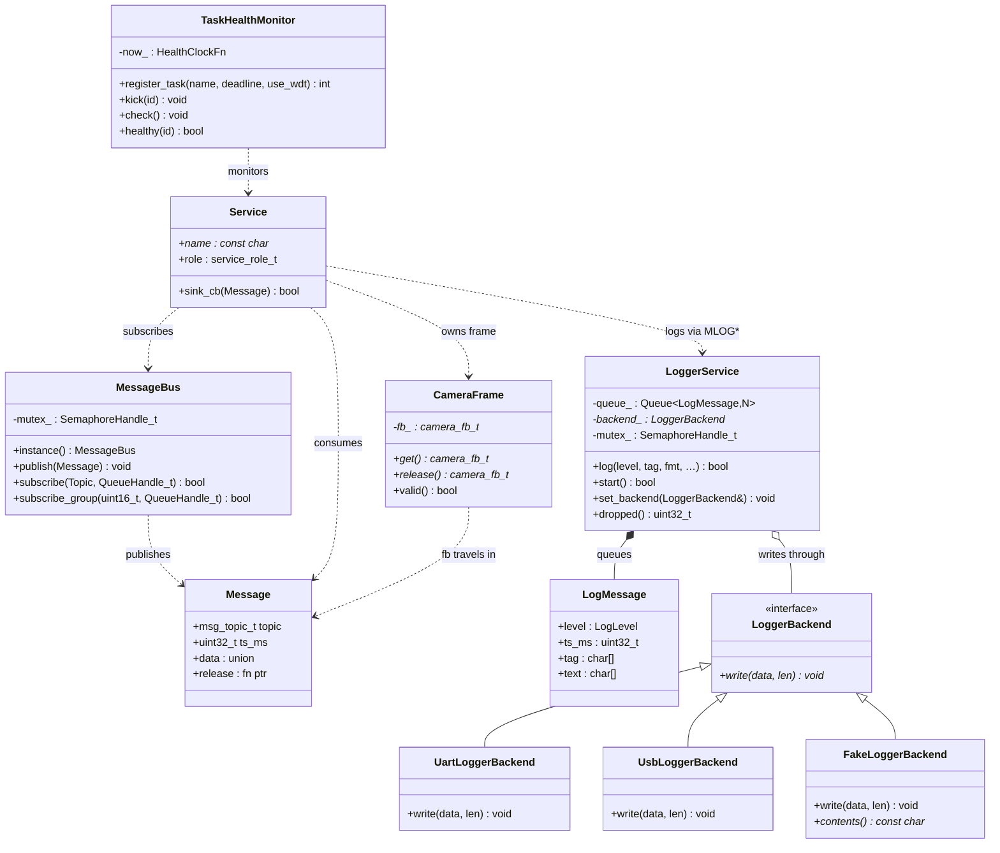

# Optional C++ Refactor / Demo Layer

ESP-MoNet is and stays a C/FreeRTOS project. This document describes an
**optional, experimental** C++ layer that demonstrates how the existing C
architecture maps to embedded-friendly C++ — without rewriting anything.

> **Default is off.** The whole layer is gated behind
> `CONFIG_MONET_CPP_EXPERIMENTAL` (default `n`). When disabled, no C++ source
> is compiled and the firmware builds, links, and runs exactly as the stable
> C path with zero flash/RAM cost.

## Goals & non-goals

- **Goal:** show the C → C++ mapping for the patterns already used in this
  codebase (ops-tables, init/deinit pairs, release hooks, `void*` queues, the
  message bus) using only embedded-safe C++.
- **Goal:** keep the stable C implementation as the default and untouched.
- **Non-goal:** rewrite services in C++ or replace `msg_bus.c` /
  `service_registry.c`. The C++ `MessageBus` is a *parallel illustration*, not
  a drop-in replacement.

## What "embedded-friendly C++" means here

Used: `class`, constructor/destructor, RAII, `enum class`/`constexpr`,
templates, simple pure-virtual interfaces, `= delete`, move semantics.

Avoided: exceptions, RTTI, `iostream`, heavy STL, and dynamic allocation.
ESP-IDF already defaults `CONFIG_COMPILER_CXX_EXCEPTIONS=n` and
`CONFIG_COMPILER_CXX_RTTI=n`; this layer stays within that. Storage is static
(function-local statics, fixed arrays, `xQueueCreateStatic`), so there is no
heap use in the demo path.

## How to enable

```sh
idf.py menuconfig
#   Component config → Monet Core → [*] Enable experimental C++ wrappers/refactor layer
#   (and optionally pick the C++ Logger backend: UART or USB-CDC)
idf.py build flash monitor
```

Or non-interactively, add to `sdkconfig` / an `sdkconfig.defaults`:

```
CONFIG_MONET_CPP_EXPERIMENTAL=y
```

When enabled, `app_main()` calls `monet_cpp_demo_run()` once at startup (which
exercises every abstraction below and logs under the `CPP_DEMO` tag), then
`monet_cpp_logger_demo_start()`, which brings up the **async LoggerService** and
the **TaskHealthMonitor** as long-lived tasks (see §6–§7).

## File layout

```
components/monet_core/
  Kconfig                         # CONFIG_MONET_CPP_EXPERIMENTAL (+ logger choice)
  CMakeLists.txt                  # conditionally adds src_cpp/ + include_cpp/
  include/monet_core/             # existing C headers — unchanged
    msg_bus.h
    service_registry.h
  src/                            # existing C sources — unchanged (stable path)
    msg_bus.c
    service_registry.c
  include_cpp/monet_core_cpp/     # C++ headers (only on INCLUDE_DIRS when enabled)
    Queue.hpp
    LockGuard.hpp
    CameraFrame.hpp
    LoggerBackend.hpp             # + FakeLoggerBackend (test sink)
    LogMessage.hpp                # POD log entry + constexpr config
    LoggerService.hpp            # async logger task + MLOG* façade
    TaskHealthMonitor.hpp        # software watchdog + TWDT backstop
    MessageBus.hpp
    message_bus_capi.h            # C-safe wrappers around the C++ bus
    cpp_demo.h                    # C-callable demo entry points
  src_cpp/                        # C++ sources (only compiled when enabled)
    CameraFrame.cpp
    Logger.cpp                    # backends incl. FakeLoggerBackend
    LoggerService.cpp
    TaskHealthMonitor.cpp
    logger_demo.cpp               # wires the service + monitor into the system
    MessageBus.cpp
    cpp_demo.cpp
test/host/                        # host-side unit tests (gcc/g++, no board)
  shim/                           # thin FreeRTOS/ESP stand-ins
  test_cpp_layer.cpp              # Unity tests for the C++ layer
  run.sh                          # build + run the tests on the host
```

The conditional compilation lives in `components/monet_core/CMakeLists.txt`:

```cmake
set(srcs src/msg_bus.c src/service_registry.c)   # always
set(include_dirs include)
if(CONFIG_MONET_CPP_EXPERIMENTAL)
    list(APPEND srcs src_cpp/CameraFrame.cpp src_cpp/Logger.cpp
                     src_cpp/LoggerService.cpp src_cpp/TaskHealthMonitor.cpp
                     src_cpp/logger_demo.cpp
                     src_cpp/MessageBus.cpp src_cpp/cpp_demo.cpp)
    list(APPEND include_dirs include_cpp)
endif()
idf_component_register(SRCS ${srcs} INCLUDE_DIRS ${include_dirs}
                       REQUIRES utils monet_hal esp_driver_gpio
                                esp_timer esp_system)
```

## The C → C++ mapping

| C idiom in this codebase | C++ equivalent | Where to look |
| --- | --- | --- |
| `struct + ctx pointer` passed to every function | object + implicit `this` | `MessageBus` (fields replace file-statics) |
| function-pointer / ops-table (`sink_cb_t`, `service_desc_t`) | interface / virtual function (vtable *is* the ops-table, `this` *is* the ctx) | `LoggerBackend` |
| manual `init()` / `deinit()` pair | constructor / destructor | `Queue`, `MessageBus`, `CameraFrame` |
| manual release hook (`msg_t.release`, `esp_camera_fb_return`) | RAII destructor | `CameraFrame` |
| `xSemaphoreTake` … `xSemaphoreGive` around a critical section | RAII `LockGuard` | `LockGuard`, used inside `MessageBus` |
| FreeRTOS queue with `void*` + `sizeof(T)` written by hand | `Queue<T, N>` (size derived from `T`) | `Queue` |
| Zephyr-style workqueue / message bus | FreeRTOS worker task + queue + callback (the existing `service_registry` dispatch task + `msg_bus`) | mirrored by `MessageBus` |
| synchronous `LOGI` on the producer task | async task+queue logger with a `LoggerBackend&` injected for testability | `LoggerService`, `LogMessage` |
| ad-hoc "is this task still alive?" checks | software watchdog with deadline tracking + ESP-IDF TWDT backstop | `TaskHealthMonitor` |

### 1. `LockGuard` — RAII over a FreeRTOS mutex

The C bus takes a mutex and must remember to give it back on **every** return
path. `LockGuard` takes it in the constructor and gives it back in the
destructor, so an early `return` can never leak the lock.

```cpp
{
    monet::LockGuard lock(mutex);   // xSemaphoreTake
    if (full) return;               // still released
    ...
}                                   // xSemaphoreGive
```

### 2. `Queue<T, N>` — type-safe queue

`xQueueCreate(8, sizeof(msg_t))` puts the element size in the caller's hands; a
mismatch corrupts memory silently. `Queue<T, N>` derives the size from `T`, so
`send()`/`receive()` only accept the right type. Backed by
`xQueueCreateStatic` (no heap). `handle()` still exposes the raw
`QueueHandle_t` for existing C APIs such as `msg_bus_subscribe`.

### 3. `CameraFrame` — RAII for zero-copy frames

The camera pipeline passes `camera_fb_t*` without copying pixels and relies on
`esp_camera_fb_return()` being called exactly once. `CameraFrame` owns the
pointer, returns it in its destructor, is **non-copyable** (copying would
double-return), and is **movable** so the buffer can be handed off zero-copy.
`release()` detaches the pointer for handing back to a C release-hook flow.

> The demo uses a stack stand-in and `release()`s it before scope exit, so the
> driver's return is never called on a non-driver buffer. In production you
> write `CameraFrame frame(esp_camera_fb_get());` and let RAII do the return.

### 4. `LoggerBackend` — interface / polymorphism

A C ops-table of function pointers becomes a pure-virtual interface. Runtime
polymorphism earns its keep only when you actually need runtime backend
selection or fallback (e.g. switch UART → USB when a host attaches). Where the
backend is fixed, `logger_default_backend()` still lets **Kconfig** pick the
concrete type at build time so unused transports do not cost flash. Backends
are static singletons (no heap).

### 5. `MessageBus` — the bus as a class

`MessageBus` mirrors `msg_bus.c` (same fan-out, same non-blocking sends, same
group rule) but the subscriber tables are object members instead of
file-statics, and every method guards the mutex with `LockGuard`. C modules
can drive it through the C API in `message_bus_capi.h`
(`monet_cpp_bus_publish` / `monet_cpp_bus_subscribe[_group]`) — names kept
distinct from `msg_bus_*` so the stable C API is never shadowed.

### 6. `LoggerService` — async, backend-pluggable logging

The existing `LOGI/LOGW/LOGE` macros (`components/utils/include/utils/log.h`)
call `ESP_LOGx` **synchronously** on the producer's task — a slow console
stalls whoever is logging. `LoggerService` makes logging asynchronous and
testable:

- Producers call `MLOGI/MLOGW/MLOGE(tag, fmt, …)` (a thin façade over
  `default_logger().log()`), which formats a fixed-size `LogMessage` POD and
  **try-enqueues** it onto a dedicated `monet::Queue<LogMessage, kLogQueueDepth>`
  with timeout 0. A single drain task pops entries and writes each through the
  active `LoggerBackend`.
- **Back-pressure policy: try-enqueue, drop-and-count on full.** A wedged
  console can cost log lines but can never block a producer. `dropped()` exposes
  the count.
- **Dependency injection.** `LoggerService(LoggerBackend&, LogClockFn = …)` —
  the backend and clock are injected, never global. Production injects the
  Kconfig-selected backend; tests inject a `FakeLoggerBackend` and a fake clock.
- **Runtime backend swap** via `set_backend()` (e.g. UART → USB fallback).
- **Locking, deliberately narrow** (per the brief's "lock what must be locked,
  no more"): the FreeRTOS queue is already thread-safe and is **not** guarded.
  Only the genuinely-shared mutable state — the active-backend pointer and the
  `dropped_` counter — is guarded with `LockGuard`. The drain task even
  *snapshots* the backend pointer under the lock and releases it before the
  (potentially slow) `write()`, so the lock covers the pointer, not the I/O.

> **Why a dedicated queue, not an `EVENT_LOG` topic on `msg_bus`?** Logs must
> not ride the sensor bus and be discarded by its timeout-0 fan-out drop policy,
> and the stable C `msg_bus.*` stays untouched. The trade-off is a second queue;
> the gain is isolation and zero edits to the production bus.

### 7. `TaskHealthMonitor` — software watchdog + TWDT backstop

The safety-product angle: a task that silently stops making progress is worse
than one that crashes, because nothing notices. The monitor makes "no progress"
observable in two layers:

- **Soft layer:** each registered task calls `kick(id)` once per healthy loop. A
  supervisor task periodically calls `check()`; any task whose last kick is
  older than its deadline is reported by name and a configurable `FailSafe`
  (`Log` / `MarkUnhealthy` / `Reset`) runs. This layer knows *which* task missed.
- **Hard layer:** if a task opts in (`use_wdt=true`), `kick()` also feeds the
  ESP-IDF **Task Watchdog** (`esp_task_wdt_add`/`esp_task_wdt_reset`). If a task
  hangs so hard it never reaches the supervisor either, the hardware-backed TWDT
  still resets the chip.
- **Testable time:** the millisecond clock is an injected `HealthClockFn`, so a
  unit test marches the clock past a deadline deterministically without sleeping.

`logger_demo.cpp` boots a heartbeat task (TWDT-fed), a worker task
(soft-monitored), and a supervisor. With `CONFIG_MONET_CPP_DEMO_HANG=y` the
worker stops checking in after a few loops and the supervisor reports the missed
deadline. The worker is intentionally not on the TWDT, so the demo never resets
a board by default.

### Intentional task priority

Logging is non-time-critical, but it must always eventually drain and must never
preempt or invert priority against the producers that feed it. The constants
live in `LogMessage.hpp` (`kLogTaskPriority` etc.) with `static_assert`s that
fail the build if the relationship is violated.

| Task | Priority | Why |
| --- | --- | --- |
| camera / mjpeg | ~10 | time-critical frame pacing |
| sensor producers | 5 | periodic sampling (service_registry default) |
| health supervisor | 4 | must observe even when the logger is backed up |
| **logger drain task** | **2** | non-time-critical; **above idle** so it always drains, **below producers** so it never preempts them or inverts priority |
| idle | 0 | — |

## Testing

The C++ logic is unit-tested **on the host** (plain gcc/g++, no board, no
ESP-IDF) by compiling the real `src_cpp/` sources against thin FreeRTOS/ESP
shims in `test/host/shim/` (a ring-buffer queue, a flag mutex, no-op
`esp_*`/TWDT stubs, a counting `esp_camera_fb_return`). This works because the
abstractions are written against injectable seams: `LoggerService` takes a
`LoggerBackend&` + clock, `TaskHealthMonitor` takes a clock, and `drain_one()`
lets a test pump the queue synchronously without a scheduler.

```sh
bash test/host/run.sh     # builds + runs the Unity suite locally and in CI
```

Coverage: log routing (enqueue → drain → `FakeBackend` received it), backend
selection/fallback, drop-on-full counting, `LockGuard` acquire/release,
`CameraFrame` move/release (buffer returned exactly once), `Queue`
send/receive/full, and `TaskHealthMonitor` deadline logic. The suite runs in
GitHub Actions alongside the existing BLE test (`.github/workflows/ci.yml`).

The genuinely on-target behavior — async logging visible over the console and a
deliberately-hung task caught by the monitor/TWDT — is verified by flashing with
`CONFIG_MONET_CPP_EXPERIMENTAL=y` (and optionally `CONFIG_MONET_CPP_DEMO_HANG=y`)
and watching the boot log; it cannot be a host unit test.

## Class diagram



## Why each abstraction exists (summary)

- **`LockGuard`** — eliminates "forgot to `xSemaphoreGive` on the error path",
  the single most common mutex bug.
- **`Queue<T, N>`** — removes the hand-written `sizeof` that turns a type
  change into silent memory corruption.
- **`CameraFrame`** — turns the implicit "you must call `fb_return` once"
  contract into a compiler-enforced one, while keeping zero-copy.
- **`LoggerBackend`** — shows interface dispatch, and shows the discipline of
  only paying for runtime polymorphism when runtime selection is real.
- **`MessageBus`** — shows the bus-as-object mapping while leaving the proven C
  bus in charge of production traffic.
- **`LoggerService`** — async task+queue, dependency injection, intentional
  priority and a documented back-pressure policy: the production-shaped service
  that ties the abstractions together and actually runs in the message flow.
- **`TaskHealthMonitor`** — turns "a task silently stopped progressing" into an
  observable, actionable event, with an ESP-IDF Task Watchdog backstop.

## Cost when disabled

`CONFIG_MONET_CPP_EXPERIMENTAL=n` (default): `src_cpp/` is not added to the
build, `include_cpp/` is not on the include path, and the `monet_cpp_demo_run()`
and `monet_cpp_logger_demo_start()` calls in `main.c` are `#if`-compiled out.
There is no measurable flash, RAM, or runtime overhead versus the pre-existing
C-only firmware.
