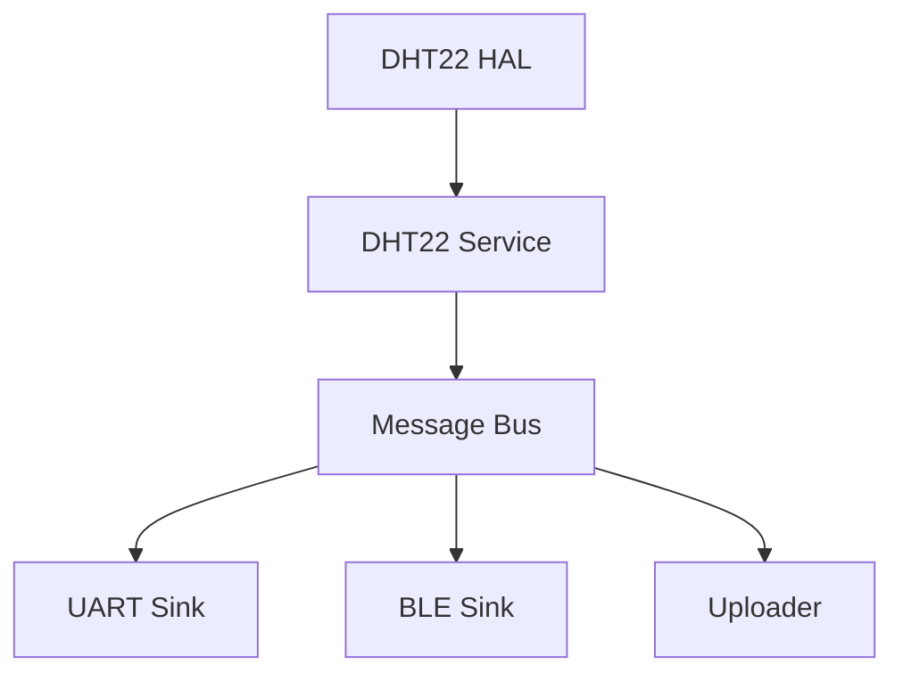

# How to Add a New Sensor

**v0.7 have change something related to this document, wait to be constructed**

This guide walks you through integrating a new sensor (e.g., DHT22 for temperature/humidity) into the system.  
Because this is a modular architecture, you can do this in **3 simple steps** — without modifying any other services (UART, BLE, HTTP, etc.).

---

## System Flow



---

## Step 1: Create a HAL Driver

**Location:** `components/monet_hal/dht22_hal.[ch]`

```c
// components/monet_hal/include/monet_hal/dht22_hal.h

/**
 * @brief Initialize DHT22 GPIO and timing
 */
esp_err_t dht22_hal_init(void);

/**
 * @brief Read temperature and humidity from DHT22 sensor
 * 
 * @param out_temp_deg_c Pointer to float storing temperature in °C
 * @param out_humidity_pct Pointer to float storing relative humidity in %
 * @return ESP_OK on success, ESP_FAIL on failure
 */
esp_err_t dht22_hal_read(float *out_temp_deg_c, float *out_humidity_pct);
```

The HAL should only handle **raw hardware access** (GPIO, timing, etc).  
If you're testing without hardware, return dummy values (e.g., 25.0°C, 60%).
the example file is already in the right position for reference

---

## Step 2: Add a Sensor Service (Publisher)

**Location:** `components/service/dht22_service.[ch]`

This service polls your sensor and **publishes messages via the system bus**.  
It is automatically started by the system after registration — **no need to manually create a task**.

**But you still need to modify msg_t struct from monet_core/msg_bus.h to support new type of data structure to fit your specific need. This repo have already cover data type like int, float, temp_hum, imu, jpeg frame buffer, and you can use uint8_t raw data as you want in initial case.**


```c
#include "service/dht22_service.h"
#include "monet_hal/dht22_hal.h"
#include "monet_core/msg_bus.h"
#include "monet_core/service_registry.h"
#include "utils/log.h"
#include "freertos/FreeRTOS.h"
#include "freertos/task.h"

static void dht22_task(void *param)
{
    if (dht22_hal_init() != ESP_OK) {
        LOGE("DHT22_SERVICE", "Init failed");
        vTaskDelete(NULL);
        return;
    }

    while (1) {
        float t, h;
        if (dht22_hal_read(&t, &h) == ESP_OK) {
            msg_t msg = {
                .topic = EVENT_SENSOR_TEMP,
                .ts_ms = esp_log_timestamp()
            };
            msg.data.temp_hum.temperature = t;
            msg.data.temp_hum.humidity = h;
            msg_bus_publish(&msg);
        }
        vTaskDelay(pdMS_TO_TICKS(1000)); // Polling interval in milliseconds, modify as needed
    }
}

static const service_desc_t dht22_service_desc = {
    .name       = "dht22_service",
    .task_fn    = dht22_task,
    .task_name  = "dht22_task",
    .stack_size = 4096,
    .priority   = 5,
    .role       = SERVICE_ROLE_PUBLISHER,
    .topics     = NULL                      // publisher doesn't subscribe
};

const service_desc_t* get_dht22_service(void)
{
    return &dht22_service_desc;
}
```

In `main.c`, just register the service:

```c
service_registry_register(get_dht22_service());
```

The system will create the task and route messages to all subscribers (UART, BLE, HTTP...) **without any hardcoding**.

If you want to dive into group control, like temp to uart and ble, light and camera to http and uart, feel free to read and modify the code in msg_bus and service_registry, there will be a new documentation talk about it in later version.

---

## Step 3: Add to CMake

Make sure the source files are listed in your build:

- In `components/monet_hal/CMakeLists.txt`, add:
  ```cmake
  srcs += src/dht22_hal.c
  ```

- In `components/service/CMakeLists.txt`, add:
  ```cmake
  srcs += src/dht22_service.c
  ```

---

## Step 4: Extend JSON Encoding (Optional)

To upload sensor data to the cloud or mobile apps, the system uses a centralized JSON encoder:

```c
#include "codec/json_encoder.h"

char json_buf[256];
json_encoder_encode(&msg, json_buf, sizeof(json_buf));
```

To support your sensor:

1. Add a new topic (e.g., `EVENT_SENSOR_TEMP`) in `msg_bus.h`
2. Extend the `msg_t` union with a matching structure (e.g., `temp_hum`)
3. Add a case in `json_encoder_encode()`:

```c
case EVENT_SENSOR_TEMP:
    snprintf(out_buf, buf_size,
        "{ \"type\": \"temp\", \"temperature\": %.2f, \"humidity\": %.2f, \"ts\": %" PRIu32 " }",
        msg->data.temp_hum.temperature,
        msg->data.temp_hum.humidity,
        msg->ts_ms);
    return true;
```

No change needed in BLE or HTTP uploader — they automatically use the encoder.

---

## Example JSON Output

```json
{
  "type": "temp",
  "temperature": 24.65,
  "humidity": 52.1,
  "ts": 3432943
}
```

---

## Done!

You’ve added a new sensor in just:

- 1 HAL file
- 1 Service file
- 2 lines of registration
- (optional) 1 line in json_encoder.c

No BLE, HTTP, or UART modification is needed.  
Want to add more sensors? Just repeat this pattern!
