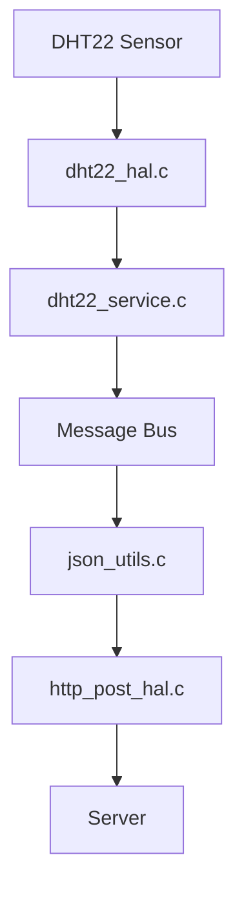

<script src="https://cdn.jsdelivr.net/npm/mermaid/dist/mermaid.min.js"></script>
<script>
  mermaid.initialize({ startOnLoad: true });
</script>

# How to Add a New Sensor

This guide walks you through adding a new sensor (e.g., DHT22 for temperature/humidity) into the system. All sensors follow a simple 3-step pattern:

---

## 1. Create a HAL Driver

Location: `components/hal/dht22_hal.[ch]`

```c
/// dht22_hal.h

/**
 * @brief Initialize DHT22 GPIO and timing
 */
void dht22_hal_init(void);

/**
 * @brief Read temperature and humidity from DHT22 sensor
 * 
 * @param out_temp_deg_c Pointer to float storing temperature in °C
 * @param out_humidity_pct Pointer to float storing relative humidity %
 * @return true if read is successful, false otherwise
 */
bool dht22_hal_read(float *out_temp_deg_c, float *out_humidity_pct);
```

---

## 2. Add a Sensor Service

Location: `components/service/dht22_service.c`

```c
void dht22_service_start(void)
{
    dht22_hal_init();

    xTaskCreate([](void *) {
        while (1) {
            float temp = 0, hum = 0;
            if (dht22_hal_read(&temp, &hum)) {
                msg_t msg = {
                    .topic = EVENT_SENSOR_TEMP,
                    .ts_ms = esp_log_timestamp(),
                };
                msg.data.temp.value = temp;
                msg_bus_publish(&msg);
            }
            vTaskDelay(pdMS_TO_TICKS(10000)); // every 10 sec
        }
    }, "dht22_task", 4096, NULL, 5, NULL);
}
```

---

## 3. Extend JSON Upload Logic

Location: `json_utils.c`

```c
bool json_build_from_msg(const msg_t *msg, char *out_buf, size_t buf_size)
{
    if (msg->topic == EVENT_SENSOR_TEMP) {
        snprintf(out_buf, buf_size,
            "{"type":"temp","value":%.2f,"ts":%lu}",
            msg->data.temp.value, msg->ts_ms);
        return true;
    }
    ...
}
```

---

## Architecture Overview



---

## Example Output

```json
{
  "type": "temp",
  "value": 24.65,
  "ts": 3432943
}
```

---

## Add it to the Project

- Add `dht22_hal.c` to `CMakeLists.txt` in `components/hal/`
- Add `dht22_service.c` to `components/service/`
- Call `dht22_service_start()` from your `app_main()` or main service start

---

## ✅ Done!

You’ve added a new sensor in just 3 simple files.  
To add more sensors (e.g. CO₂, PIR, Light), repeat with:

- 1x HAL driver
- 1x Service
- 1x JSON encoder